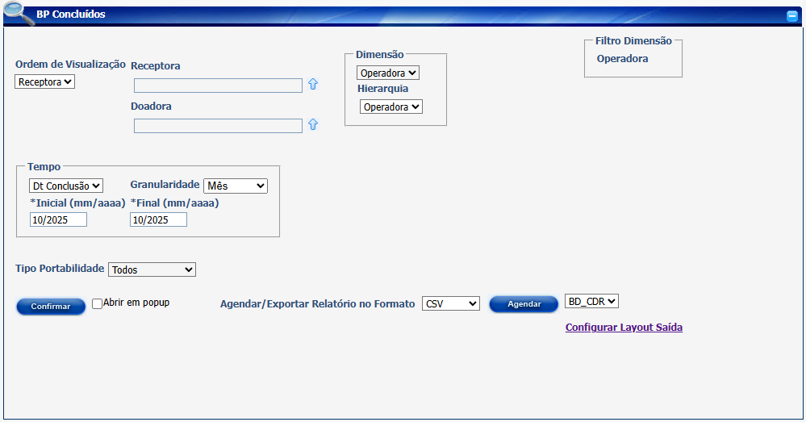
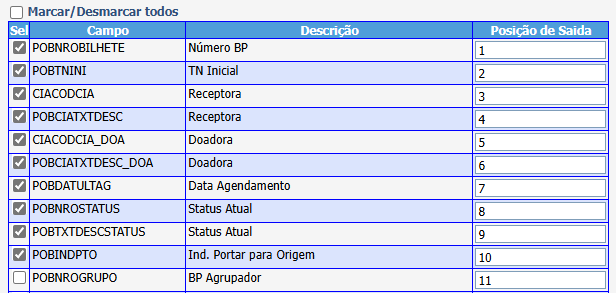

# Módulo de Importação de Dados da ABR Telecom

## Visão Geral

O módulo `abr_loader.py` fornece funcionalidade para importar dados de portabilidade numérica e dos planos de numeração de telefonia brasileira provenientes de relatórios dos sistemas PIP, Portal de Informações da Portabilidade e NSAPN, Novo Sistema de Administração dos Planos de Numeração, respectivamente. 

O módulo processa arquivos com informações de portabilidade e numeração e os importa para um banco de dados PostgreSQL com desempenho otimizado através de processamento em lotes e operações de inserção em massa.

## Características Principais

- ✅ **Processamento de arquivo único ou múltiplos arquivos**
- ✅ **Leitura eficiente em chunks** para otimizar uso de memória
- ✅ **Inserções em massa no banco** usando PostgreSQL COPY FROM
- ✅ **Logging abrangente** com rastreamento de progresso
- ✅ **Validação de dados** e otimização de tipos
- ✅ **Criação automática de tabelas** com índices otimizados

## Instalação e Dependências


## Importação dos dados de portabilidade

### Formato do Arquivo de Entrada

Os arquivos para importação devem ser extraídos do sistema PIP no formato CSV comprimido (*.csv.gz) com as seguintes colunas:

| Coluna do Relatório        | Coluna Layout PIP | Descrição PIP              | Tipo no BD   |
|----------------------------|-------------------|----------------------------|--------------|
| TIPO REG                   | -                 | Tipo de Registro           | INT8         |
| NUMERO BP                  | POBNROBILHETE     | Número BP                  | INT8         |
| TN INICIAL                 | POBTNINI          | TN Inicial                 | INT8         |
| RECEPTORA                  | CIACODCIA         | Código Operadora Receptora | INT2         |
| RECEPTORA                  | POBCIATXTDESC     | Nome Operadora Receptora   | VARCHAR(100) |
| DOADORA                    | CIACODCIA_DOA     | Código Operadora Doadora   | INT2         |
| DOADORA                    | POBCIATXTDESC_DOA | Nome Operadora Doadora     | VARCHAR(100) |
| DATA AGENDAMENTO           | POBDATULTAG       | Data Agendamento           | TIMESTAMP    |
| STATUS ATUAL               | POBNROSTATUS      | Código Status Atual        | INT2         |
| STATUS ATUAL               | POBTXTDESCSTATUS  | Descrição Status Atual     | VARCHAR(50)  |
| IND. PORTAR PARA ORIGEM    | POBINDPTO         | Indicador Portar p/ Origem | INT2         |

Exemplo de dados do arquivo
```csv
TIPO REG;NUMERO BP;TN INICIAL;RECEPTORA;RECEPTORA;DOADORA;DOADORA;DATA AGENDAMENTO;STATUS ATUAL;STATUS ATUAL;IND. PORTAR PARA ORIGEM
1;7266080;2139838686;0123;TIM SA;0121;EMBRATEL;11/06/2010 00:00:00;1;Ativo;Nao
1;7266082;2139838688;0123;TIM SA;0121;EMBRATEL;11/06/2010 00:00:00;1;Ativo;Nao
1;7266083;2139838689;0123;TIM SA;0121;EMBRATEL;11/06/2010 00:00:00;1;Ativo;Nao
```

### Extração dos arquivos para importação no PIP

Para obter os arquivos para importação no PIP execute e exporte o relatório "BP Concluído" em formato CSV, com layout de saída com as colunas indicadas:

**Parâmetros para extração do relatório de BP Concluído**



**Layout de saída**




## Uso Básico

```bash
Usage: abr_loader load-pip [OPTIONS] INPUT_PATH TABLE_NAME SCHEMA_NAME

 Import ABR portability data into PostgreSQL database.

 This command processes Brazilian phone number portability reports from ABR Telecom's PIP system. The input files should be in
 CSV format (*.csv.gz) with specific column structure defined by ABR standards.
 The import process includes: - Automatic table creation with optimized schema - Chunked processing for memory efficiency - Bulk
 insertions using PostgreSQL COPY FROM - Comprehensive progress tracking and error handling - Data type optimization and
 validation

 Args:     
    input_path: Path to CSV file or directory containing CSV files     
    table_name: Target database table (created if doesn't exist)     
    schema: Target database schema (must already exist)     
    truncate_table: Whether to clear existing data before import
    rebuild_database: Whether to rebuild the entire database before import

 Returns:     
    None: Results are logged to console and log file

 Raises:     
    typer.Exit: On file not found, database connection errors, or import failures

 Examples:     
    Import single file with default settings:     
        $ abr_loader load-portability data.csv.gz
    Import directory to custom table:     
        $ abr_loader load-portability /data/ my_table my_schema
    Append data without truncating:     
        $ abr_loader load-portability /data/ --no-truncate-table

╭─ Arguments ────────────────────────────────────────────────────────────────────────────────────────────────────────────────────╮
│ *    input_path      TEXT         Path to input file or directory. If directory provided, all *.csv.gz files will be processed │
│                                   recursively. Supports single files or batch processing.                                      │
│                                   [required]                                                                                   │
│      table_name      TEXT         Database table name for data storage. Table will be created automatically if it doesn't      │
│                                   exist.                                                                                       │
│                                   [default: abr_portabilidade]                                                                 │
│      schema          SCHEMA_NAME  Database schema name for table organization. Schema must exist in the target database.       │
│                                   [default: entrada]                                                                           │
╰────────────────────────────────────────────────────────────────────────────────────────────────────────────────────────────────╯
╭─ Options ──────────────────────────────────────────────────────────────────────────────────────────────────────────────────────╮
│ --truncate-table      --no-truncate-table        Truncate table before import. When enabled, existing data will be deleted     │
│                                                  before import. Use --no-truncate-table to append to existing data.            │
│                                                  [default: truncate-table]                                                     │
│ --rebuild-database    --no-rebuild-database      Rebuild database entire portability database. When enabled, existing data     │
│                                                  will be deleted before import. Use --no-rebuild-database to append to         │
│                                                  existing data.                                                                │
│                                                  [default: no-rebuild-database]                                                │
│ --help                                           Show this message and exit.                                                   │
╰────────────────────────────────────────────────────────────────────────────────────────────────────────────────────────────────╯
```

### Importar um único arquivo

```bash
# Ativar o ambiente virtual Python
$ source repositorios/teletools/.venv/bin/activate

# Importar um arquivo
(teletools) $ abr_loader load-pip /data/cdr/arquivos_auxiliares/abr/portabilidade/pip/relatorios_mensais/relatorio_bilhetes_portabilidade_pip_202502.csv.gz

# Desativar o ambiente virtual Python
(teletools) $ deactivate
$
```

### Importar todos os arquivos de um diretório

```bash
# Ativar o ambiente virtual Python
$ source repositorios/teletools/.venv/bin/activate

# Importar um diretório que contém arquivos .csv.gz
(teletools) $ abr_loader load-pip /data/cdr/arquivos_auxiliares/abr/portabilidade/pip/

# Desativar o ambiente virtual Python
(teletools) $ deactivate
$
```

## Limitações Conhecidas

1. **Formato de arquivo fixo:** Requer formato CSV específico da ABR
2. **Encoding:** Assume UTF-8 (pode requerer ajuste para outros encodings)
3. **Sem paralelização:** Processa arquivos sequencialmente
4. **PostgreSQL apenas:** Não suporta outros bancos de dados nativamente

h
## Contribuindo

Para contribuir com melhorias neste módulo:
1. Fork o repositório `teletools`
2. Crie um branch para sua feature
3. Implemente testes para novas funcionalidades
4. Submeta um pull request

## Licença

Este módulo é parte do projeto `teletools` e segue a mesma licença do projeto principal.

## Contato e Suporte

Para questões, bugs ou sugestões:
- Abra uma issue no repositório do projeto
- Consulte a documentação adicional em `/docs`

---

**Última atualização:** Novembro 2025  
**Versão do módulo:** 1.0  
**Compatibilidade:** Python 3.10+, PostgreSQL 12+
