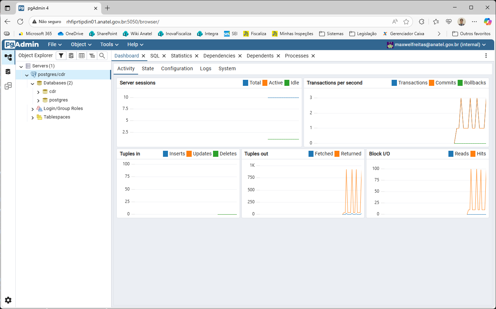
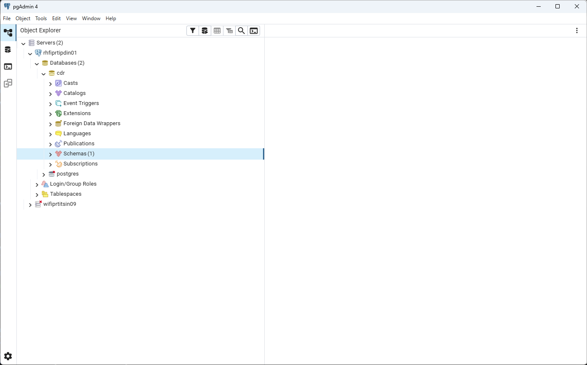

# Teletools database

Teletools database é um conjunto de arquivos para a construção de uma solução conteinerizada para execução de um banco de dados PostgreSQL customizado para o pré-processamento de dados para tratamento de arquivos CDR (Detalhes de Registros de Chamadas) de operadoras brasileiras. 

## Sobre

Teletools database constroi uma imagem customizada de um banco de dados PostgreSQL a partir da [imagem oficial Docker](https://hub.docker.com/_/postgres) com as extensões requeridas para processamento dos dados extraídos de diversas fontes.

Teletools database contém ainda uma versão web da ferramenta de adminstração para PostgreSQL [pgAdmin 4](https://hub.docker.com/r/dpage/pgadmin4).

## 🚀 Configuração

### Pré-requisitos

- docker: versão 28 ou superior

### Configuração do Ambiente

Clone o repositório e construa a imagem customizada:

```bash
# Clonar o repositório
git clone https://github.com/InovaFiscaliza/teletools
cd teletools/pgdatabase

# Construir a imagem customizada
docker build -t postgrescdr .
```

Crie os usuários para os serviços
```bash
# Criar o grupo postgres com GID 999
sudo groupadd -g 999 postgres
# Criar o usuário postgres com UID 999
sudo useradd -u 999 postgres -g postgres

# Criar o grupo pgadmin com GID 5050
sudo groupadd -g 5050 pgadmin
# Criar o usuário pgadmin com UID 999
sudo useradd -u 5050 pgadmin -g pgadmin
```
⚠️ **Atenção** os usuários e grupos devem ser criados com os UID e GID especificados, caso contrário os serviços dos conteineres não persistirão os dados.

Crie dos diretórios de dados e ajuste as permissões
```bash
# Criar os diretórios
mkdir -p /data/postgresql/data
mkdir -p /data/postgresql/pgadmin

# Configurar proprietário e permissões
sudo chown -R postgres /data/postgresql/data
sudo chown -R pgadmin /data/postgresql/pgadmin
sudo chmod -R g+s /data/postgresql/data
sudo chmod -R g+s /data/postgresql/pgadmin
```
Criar o arquivo de variáveis de ambiente (`.env`)
```
POSTGRES_USER=<postgres_admin_username>
POSTGRES_PASSWORD=<postgres_admin_username>
POSTGRES_DB=<postgres_default_database>
PGADMIN_DEFAULT_EMAIL=<pgadmin_admin_user_email>
PGADMIN_DEFAULT_PASSWORD=<pgadmin_admin_user_password>
PGADMIN_LISTEN_ADDRESS=0.0.0.0
```
| Variável                   | Descrição                                                       |
| -------------------------- | --------------------------------------------------------------- |
| `POSTGRES_USER`            | Cria o superusuário com o nome especificado                     |
| `POSTGRES_PASSWORD`        | Define a senha do superusuário do PostgreSQL                    |
| `POSTGRES_DB`              | Cria o banco de dados padrão com o nome especificado            |
| `PGADMIN_DEFAULT_EMAIL`    | Cria a conta inicial de administrador com o e-mail especificado |
| `PGADMIN_DEFAULT_PASSWORD` | Cria a senha inicial do administrador                           |
| `PGADMIN_LISTEN_ADDRESS  ` | Especifica o endereço que o serviços ficará escutando           |

Execute o docker compose
```bash
# Executar docker compose
docker compose up -d
```
### Acesso ao PostgreSQL

Após a configuração o banco de dados PostgreSQL pode ser acessado através do pgAdmin web ou desktop.



Para acessar através do pgAdmin web acesse o endereço http://<host_de_instação>:5050 e utilize o e-mail e senha do pgAdmin informados no arquivo de configuração (`PGADMIN_DEFAULT_EMAIL` e `PGADMIN_DEFAULT_PASSWORD`) e configure o acesso ao servidor PostgreSQL informando hostname `postgres` e usuário e senha do PostgreSQL informados no arquivo de configuração (`POSTGRES_USER` e `POSTGRES_PASSWORD`).



Para acessar através do pgAdmin desktop configure o acesso ao servidor PostgreSQL informando hostname <host_de_instação> e usuário e senha do PostgreSQL informados no arquivo de configuração (`POSTGRES_USER` e `POSTGRES_PASSWORD`).

### Instalação das extensões

Conectar com o banco de dados e executar o SQL
```sql
CREATE EXTENSION amcheck;
CREATE EXTENSION btree_gin;
CREATE EXTENSION file_fdw;
CREATE EXTENSION fuzzystrmatch;
CREATE EXTENSION ogr_fdw;
CREATE EXTENSION pg_stat_statements;
CREATE EXTENSION postgis;
CREATE EXTENSION postgis_raster;
CREATE EXTENSION system_stats;
CREATE EXTENSION tablefunc;
CREATE EXTENSION unaccent;
```
### Configuração dos parâmetros de performance

Editar o arquivo de configuração do PostgreSQL
```bash
sudo su - postgres
cd /data/postresql/data
cp postgresql.conf postgresql.conf.bkp
nano postgresql.conf

# descomentar as linhas, se necessário e ajustar os parâmetros
# MEMÓRIA
shared_buffers = 16GB
work_mem = 384MB
maintenance_work_mem = 2GB
effective_cache_size = 48GB
 
# PARALELISMO
max_parallel_workers = 40
max_parallel_workers_per_gather = 10
parallel_setup_cost = 100.0
parallel_tuple_cost = 0.01
 
# I/O
random_page_cost = 1.1
effective_io_concurrency = 200
checkpoint_timeout = 15min
 
# PLANNER
default_statistics_target = 1000
geqo_threshold = 16
 
# OUTROS
jit = off
huge_pages = try
max_connections = 100
```

### Configuração do banco de dado CDR

#### Criação dos grupos e usuários

Criar grupo de usuários
```sql
CREATE ROLE cdr_database_users WITH
	NOLOGIN
	NOSUPERUSER
	NOCREATEDB
	NOCREATEROLE
	INHERIT
	NOREPLICATION
	NOBYPASSRLS
	CONNECTION LIMIT -1;
COMMENT ON ROLE cdr_database_users IS 'Grupo de usuários do banco de dados CDR';
```
Criar usuários
```sql
-- Script para criar usuários
DO $$
DECLARE
    user_name TEXT := '<user_name>';
    user_password TEXT := '<user_password>';
    user_full_name TEXT := '<user_full_name>';
BEGIN
    -- Criar a role
    EXECUTE format('CREATE ROLE %I WITH LOGIN NOSUPERUSER NOCREATEDB NOCREATEROLE INHERIT NOREPLICATION NOBYPASSRLS CONNECTION LIMIT -1 PASSWORD %L', 
                   user_name, user_password);
    
    -- Conceder privilégios
    EXECUTE format('GRANT cdr_database_users TO %I', user_name);
    
    -- Adicionar comentário
    EXECUTE format('COMMENT ON ROLE %I IS %L', user_name, user_full_name);
END $$;
```

### Criação dos esquemas do banco de dados CDR

Executar o [script](sql/create_schemas.sql)

---

## 👤 Autores

**Ronaldo S.A. Batista**
- Email: eu@ronaldo.tech

**Maxwel de Souza Freitas**
- Email: maxwel@maxwelfreitas.com.br

---

**Versão:** 0.1.0
**Última atualização:** 2025-10-31
**Status:** Em desenvolvimento ativo