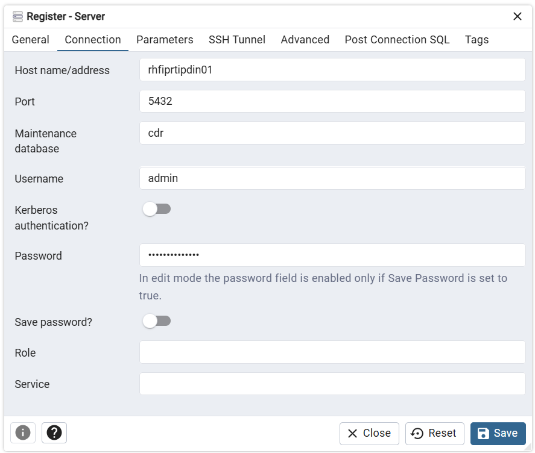

# Teletools database

Teletools database é um conjunto de arquivos para a construção de uma solução conteinerizada para execução de um banco de dados PostgreSQL customizado para o pré-processamento de dados para tratamento de arquivos CDR (Detalhes de Registros de Chamadas) de operadoras brasileiras. 

## Sobre

Teletools database constroi uma imagem customizada de um banco de dados PostgreSQL a partir da [imagem oficial Docker](https://hub.docker.com/_/postgres) com as extensões requeridas para processamento dos dados extraídos de diversas fontes.

Teletools database contém ainda uma versão web da ferramenta de adminstração para PostgreSQL [pgAdmin 4](https://hub.docker.com/r/dpage/pgadmin4).

## 🚀 Configuração

### Pré-requisitos

- docker: versão 28 ou superior

### Configuração do Ambiente

Clone o repositório e construa a imagem customizada:

```bash
# Clonar o repositório
git clone https://github.com/InovaFiscaliza/teletools
cd teletools/pgdatabase

# Construir a imagem customizada
docker build -t postgrescdr .
```

Crie os usuários para os serviços
```bash
# Criar o grupo postgres com GID 999
sudo groupadd -g 999 postgres
# Criar o usuário postgres com UID 999
sudo useradd -u 999 postgres -g postgres

# Criar o grupo pgadmin com GID 5050
sudo groupadd -g 5050 pgadmin
# Criar o usuário pgadmin com UID 999
sudo useradd -u 5050 pgadmin -g pgadmin
```
⚠️ **Atenção** os usuários e grupos devem ser criados com os UID e GID especificados, caso contrário os serviços dos conteineres não persistirão os dados.

Crie dos diretórios de dados e ajuste as permissões
```bash
# Criar os diretórios
mkdir -p /data/postgresql/data
mkdir -p /data/postgresql/pgadmin

# Configurar proprietário e permissões
sudo chown -R postgres /data/postgresql/data
sudo chown -R pgadmin /data/postgresql/pgadmin
sudo chmod -R g+s /data/postgresql/data
sudo chmod -R g+s /data/postgresql/pgadmin
```
Crie o arquivo de variáveis de ambiente (`.env`)
```
POSTGRES_USER=<postgres_admin_username>
POSTGRES_PASSWORD=<postgres_admin_username>
POSTGRES_DB=<postgres_default_database>
PGADMIN_DEFAULT_EMAIL=<pgadmin_admin_user_email>
PGADMIN_DEFAULT_PASSWORD=<pgadmin_admin_user_password>
PGADMIN_LISTEN_ADDRESS=0.0.0.0
```
| Variável                   | Descrição                                                       |
| -------------------------- | --------------------------------------------------------------- |
| `POSTGRES_USER`            | Cria o superusuário com o nome especificado                     |
| `POSTGRES_PASSWORD`        | Define a senha do superusuário do PostgreSQL                    |
| `POSTGRES_DB`              | Cria o banco de dados padrão com o nome especificado            |
| `PGADMIN_DEFAULT_EMAIL`    | Cria a conta inicial de administrador com o e-mail especificado |
| `PGADMIN_DEFAULT_PASSWORD` | Cria a senha inicial do administrador                           |
| `PGADMIN_LISTEN_ADDRESS  ` | Especifica o endereço que o serviços ficará escutando           |

Execute o docker compose
```bash
# Executar docker compose
docker compose up -d
```
### Acesso ao PostgreSQL

Após a configuração o banco de dados PostgreSQL pode ser acessado através do pgAdmin (web ou desktop) ou de outra ferramenta para gerenciamento de banco de dados.

Para acessar através do pgAdmin web acesse o endereço http://<host_de_instalação>:5050 e utilize o e-mail e senha do pgAdmin informados no arquivo de configuração (`PGADMIN_DEFAULT_EMAIL` e `PGADMIN_DEFAULT_PASSWORD`)

Configure a conexão ao servidor PostgreSQL com os seguintes parâmetros:

| Parâmetro            | Valor                |
| -------------------- | ---------------------|
| Host name/address    | <host_de_instalação> |
| Port                 | 5432                 |
| Maintenance database | `POSTGRES_DB`        |
| Username             | `POSTGRES_USER`      |
| Password             | `POSTGRES_PASSWORD`  |





### Instalação das extensões

Conecte no banco de dados e execute o SQL
```sql
-- Instalar extensões
CREATE EXTENSION amcheck;
CREATE EXTENSION btree_gin;
CREATE EXTENSION file_fdw;
CREATE EXTENSION fuzzystrmatch;
CREATE EXTENSION ogr_fdw;
CREATE EXTENSION pg_stat_statements;
CREATE EXTENSION pgstattuple;
CREATE EXTENSION postgis;
CREATE EXTENSION postgis_raster;
CREATE EXTENSION system_stats;
CREATE EXTENSION tablefunc;
CREATE EXTENSION unaccent;
```
### Configuração dos parâmetros de performance

Edite o arquivo de configuração do PostgreSQL 
```bash
sudo su - postgres
cd /data/postresql/data
cp postgresql.conf postgresql.conf.bkp.$(date +%Y%m%d_%H%M%S)
nano postgresql.conf
```
Verifique os parâmetros listados e os ajuste, se necessário.

|Parâmetro                      |Descrição                                                                                         |Valor padrão|Valor ajustado|
|-------------------------------|--------------------------------------------------------------------------------------------------|------------|--------------|
|autovacuum                     |Starts the autovacuum subprocess.                                                                 |on          |on            |
|autovacuum_vacuum_cost_limit   |Vacuum cost amount available before napping, for                                                  |-1          |2000          |
|autovacuum_max_workers         |Sets the maximum number of simultaneously running autovacuum worker processes.                    |3           |6             |
|autovacuum_vacuum_scale_factor |Number of tuple updates or deletes prior to vacuum as a fraction of reltuples.                    |0.2         |0.2           |
|checkpoint_timeout             |Sets the maximum time between automatic WAL checkpoints.                                          |300         |1800s         |
|deadlock_timeout               |Sets the time to wait on a lock before checking for deadlock.                                     |1000        |2s            |
|default_statistics_target      |Sets the default statistics target.                                                               |100         |1000          |
|effective_cache_size           |Sets the planner's assumption about the total size of the data caches.                            |524288      |6GB           |
|effective_io_concurrency       |Number of simultaneous requests that can be handled efficiently by the disk subsystem.            |16          |200           |
|geqo_threshold                 |Sets the threshold of FROM items beyond which GEQO is used.                                       |12          |16            |
|huge_pages                     |Use of huge pages on Linux or Windows.                                                            |try         |try           |
|jit                            |Allow JIT compilation.                                                                            |on          |off           |
|listen_addresses               |Sets the host name or IP address(es) to listen to.                                                |*           |*             |
|log_min_duration_statement     |Sets the minimum execution time above which all statements will be logged.                        |-1          |10000         |
|maintenance_work_mem           |Sets the maximum memory to be used for maintenance operations.                                    |65536       |4GB           |
|max_connections                |Sets the maximum number of concurrent connections.                                                |100         |100           |
|max_locks_per_transaction      |Sets the maximum number of locks per transaction.                                                 |64          |256           |
|max_parallel_workers           |Sets the maximum number of parallel workers that can be active at one time.                       |8           |16            |
|max_parallel_workers_per_gather|Sets the maximum number of parallel processes per executor node.                                  |2           |8             |
|max_wal_size                   |Sets the WAL size that triggers a checkpoint.                                                     |1024        |64GB          |
|min_wal_size                   |Sets the minimum size to shrink the WAL to.                                                       |80          |2GB           |
|parallel_setup_cost            |Sets the planner's estimate of the cost of starting up worker processes for parallel query.       |1000        |200.0         |
|parallel_tuple_cost            |Sets the planner's estimate of the cost of passing each tuple (row) from worker to leader backend.|0.1         |0.1           |
|random_page_cost               |Sets the planner's estimate of the cost of a nonsequentially fetched disk page.                   |4           |1.1           |
|shared_buffers                 |Sets the number of shared memory buffers used by the server.                                      |2097152     |20GB          |
|synchronous_commit             |Sets the current transaction's synchronization level.                                             |on          |local         |
|temp_buffers                   |Sets the maximum number of temporary buffers used by each session.                                |1024        |4096          |
|wal_level                      |Sets the level of information written to the WAL.                                                 |replica     |minimal       |
|work_mem                       |Sets the maximum memory to be used for query workspaces.                                          |4096        |2GB           |

### Configuração do banco de dado CDR

#### Criação/atualização dos esquemas, roles e grante
```sql
-- =======================================
-- Script idempotente para criação/atualização de roles e grants
-- =======================================
-- Este script:
-- - Cria roles se não existirem, ou altera atributos se existirem.
-- - Grants são idempotentes (GRANT múltiplas vezes não causa erro).
-- - ALTER DEFAULT PRIVILEGES sobrescreve existentes para o role.
-- - Para SUPERUSER: Altera se necessário.
-- Rode como superusuário (ex.: admin).

-- =======================================
-- Definição dos esquemas e suas descrições
-- =======================================
-- Tabela temporária para armazenar os esquemas
CREATE TEMP TABLE IF NOT EXISTS temp_schemas (
    name TEXT PRIMARY KEY,
    description TEXT
);

-- Limpa e popula a tabela com os esquemas
TRUNCATE temp_schemas;
INSERT INTO temp_schemas (name, description) VALUES
    ('dw', 'Esquema temporário para armazenamento de dados disponíveis no DW_ANATEL'),
    ('entrada', 'Esquema para armazenamento dos dados de entrada.'),
    ('mapas', 'Esquema para armazenamento de mapas.'),
    ('public', 'Esquema público padrão do PostgreSQL.');

-- Criação dos esquemas
DO $$
DECLARE
    schema_rec RECORD;
BEGIN
    FOR schema_rec IN SELECT name, description FROM temp_schemas
    LOOP
        -- Criar esquema se não existir
        IF NOT EXISTS (SELECT 1 FROM pg_namespace WHERE nspname = schema_rec.name) THEN
            EXECUTE format('CREATE SCHEMA %I', schema_rec.name);
        END IF;
        
        -- Definir comentário no esquema
        EXECUTE format('COMMENT ON SCHEMA %I IS %L', schema_rec.name, schema_rec.description);
    END LOOP;
END $$;

-- =======================================
-- Definição das funções auxiliares
-- =======================================
-- Função auxiliar para verificar se role existe (usada em DO)
CREATE OR REPLACE FUNCTION role_exists(role_name TEXT) RETURNS BOOLEAN AS $$
BEGIN
    RETURN EXISTS (SELECT 1 FROM pg_roles WHERE rolname = role_name);
END;
$$ LANGUAGE plpgsql;

-- Função auxiliar para obter lista de nomes de esquemas
CREATE OR REPLACE FUNCTION get_schema_names() RETURNS TEXT[] AS $$
BEGIN
    RETURN ARRAY(SELECT name FROM temp_schemas ORDER BY name);
END;
$$ LANGUAGE plpgsql;

-- =======================================
-- Criação/Atualização dos grupos (roles)
-- =======================================

-- cdr_user_ler
DO $$
BEGIN
    IF NOT role_exists('cdr_user_ler') THEN
        CREATE ROLE cdr_user_ler
           NOLOGIN
           NOSUPERUSER
           NOCREATEDB
           NOCREATEROLE
           NOREPLICATION
           NOBYPASSRLS;
    ELSE
        -- Altera atributos se necessário (ex.: garantir NOSUPERUSER, etc.)
        ALTER ROLE cdr_user_ler NOLOGIN;
        ALTER ROLE cdr_user_ler NOSUPERUSER;
        ALTER ROLE cdr_user_ler NOCREATEDB;
        ALTER ROLE cdr_user_ler NOCREATEROLE;
        ALTER ROLE cdr_user_ler NOREPLICATION;
        ALTER ROLE cdr_user_ler NOBYPASSRLS;
    END IF;
END $$;

-- cdr_user_gravar
DO $$
BEGIN
    IF NOT role_exists('cdr_user_gravar') THEN
        CREATE ROLE cdr_user_gravar
           NOLOGIN
           NOSUPERUSER
           NOCREATEDB
           NOCREATEROLE
           NOREPLICATION
           NOBYPASSRLS;
    ELSE
        ALTER ROLE cdr_user_gravar NOLOGIN;
        ALTER ROLE cdr_user_gravar NOSUPERUSER;
        ALTER ROLE cdr_user_gravar NOCREATEDB;
        ALTER ROLE cdr_user_gravar NOCREATEROLE;
        ALTER ROLE cdr_user_gravar NOREPLICATION;
        ALTER ROLE cdr_user_gravar NOBYPASSRLS;
    END IF;
END $$;

-- cdr_user_super
DO $$
BEGIN
    IF NOT role_exists('cdr_user_super') THEN
        CREATE ROLE cdr_user_super NOLOGIN SUPERUSER;
    ELSE
        ALTER ROLE cdr_user_super NOLOGIN;
        ALTER ROLE cdr_user_super SUPERUSER;  -- Garante superusuário
    END IF;
END $$;

-- =======================================
-- Grants para cdr_user_ler: Apenas leitura (SELECT em tables e views)
-- =======================================
-- Para cada esquema existente
DO $$
DECLARE
    schema_name TEXT;
BEGIN
    FOREACH schema_name IN ARRAY get_schema_names() LOOP
        EXECUTE format('GRANT USAGE ON SCHEMA %I TO cdr_user_ler', schema_name);
        EXECUTE format('GRANT SELECT ON ALL TABLES IN SCHEMA %I TO cdr_user_ler', schema_name);
        EXECUTE format('GRANT SELECT ON ALL SEQUENCES IN SCHEMA %I TO cdr_user_ler', schema_name);
        -- Para views: SELECT já cobre, pois views são tratadas como tables para grants
    END LOOP;
END $$;

-- Para tabelas/views futuras (default privileges) - sobrescreve se existirem
DO $$
DECLARE
    schema_name TEXT;
BEGIN
    FOREACH schema_name IN ARRAY get_schema_names() LOOP
        EXECUTE format('ALTER DEFAULT PRIVILEGES IN SCHEMA %I GRANT SELECT ON TABLES TO cdr_user_ler', schema_name);
    END LOOP;
END $$;

-- =======================================
-- Grants para cdr_user_gravar: Leitura + Gravação + Criação/Alteração/Apagamento de tabelas e dados
-- =======================================
-- Para cada esquema existente
DO $$
DECLARE
    schema_name TEXT;
BEGIN
    FOREACH schema_name IN ARRAY get_schema_names() LOOP
        EXECUTE format('GRANT USAGE, CREATE ON SCHEMA %I TO cdr_user_gravar', schema_name);  -- CREATE para criar/alterar/drop tables no schema
        EXECUTE format('GRANT ALL PRIVILEGES ON ALL TABLES IN SCHEMA %I TO cdr_user_gravar', schema_name);  -- ALL inclui SELECT, INSERT, UPDATE, DELETE, TRUNCATE, REFERENCES
        EXECUTE format('GRANT ALL PRIVILEGES ON ALL SEQUENCES IN SCHEMA %I TO cdr_user_gravar', schema_name);  -- ALL para sequences (USAGE, SELECT)
    END LOOP;
END $$;

-- Para tabelas/views futuras (default privileges) - sobrescreve se existirem
DO $$
DECLARE
    schema_name TEXT;
BEGIN
    FOREACH schema_name IN ARRAY get_schema_names() LOOP
        EXECUTE format('ALTER DEFAULT PRIVILEGES IN SCHEMA %I GRANT ALL PRIVILEGES ON TABLES TO cdr_user_gravar', schema_name);
    END LOOP;
END $$;

-- =======================================
-- Grants para cdr_user_super: Como é SUPERUSER, herda tudo, mas concedemos explicitamente para schemas
-- =======================================
-- Para cada esquema existente (USAGE e CREATE para completude, mas SUPERUSER ignora restrições)
DO $$
DECLARE
    schema_name TEXT;
BEGIN
    FOREACH schema_name IN ARRAY get_schema_names() LOOP
        EXECUTE format('GRANT ALL ON SCHEMA %I TO cdr_user_super', schema_name);  -- ALL inclui USAGE, CREATE, etc.
    END LOOP;
END $$;

-- Para objetos existentes (tables, sequences) - SUPERUSER pode acessar tudo, mas para explicitar
DO $$
DECLARE
    schema_name TEXT;
BEGIN
    FOREACH schema_name IN ARRAY get_schema_names() LOOP
        EXECUTE format('GRANT ALL PRIVILEGES ON ALL TABLES IN SCHEMA %I TO cdr_user_super', schema_name);
        EXECUTE format('GRANT ALL PRIVILEGES ON ALL SEQUENCES IN SCHEMA %I TO cdr_user_super', schema_name);
    END LOOP;
END $$;

-- Para objetos futuros - SUPERUSER ignora, mas para consistência (sobrescreve se existirem)
DO $$
DECLARE
    schema_name TEXT;
BEGIN
    FOREACH schema_name IN ARRAY get_schema_names() LOOP
        EXECUTE format('ALTER DEFAULT PRIVILEGES IN SCHEMA %I GRANT ALL PRIVILEGES ON TABLES TO cdr_user_super', schema_name);
        EXECUTE format('ALTER DEFAULT PRIVILEGES IN SCHEMA %I GRANT ALL PRIVILEGES ON SEQUENCES TO cdr_user_super', schema_name);
        EXECUTE format('ALTER DEFAULT PRIVILEGES IN SCHEMA %I GRANT ALL PRIVILEGES ON FUNCTIONS TO cdr_user_super', schema_name);  -- Para funções
    END LOOP;
END $$;

-- Limpeza: Remove as funções auxiliares e tabela temporária (opcional, mas mantém o DB limpo)
DROP FUNCTION IF EXISTS role_exists(TEXT);
DROP FUNCTION IF EXISTS get_schema_names();
DROP TABLE IF EXISTS temp_schemas;
```

#### Criação dos usuários

Criar usuário super (administrador do banco de dados)
```sql
-- =======================================
-- Script idempotente para criação/atualização de usuários
-- =======================================
-- Este script:
-- - Cria usuários se não existirem, ou altera atributos se existirem.
-- - Grants são idempotentes (GRANT múltiplas vezes não causa erro).
-- Rode como superusuário (ex.: admin).

-- =======================================
-- Criação/Atualização do usuário específico e grant do grupo super
-- =======================================
DO $$
DECLARE
    user_name TEXT := 'cdr.service.super';
    user_password TEXT := 'senha_do_usuario_aqui';  -- Defina a senha aqui se necessário
    user_description TEXT := 'Usuário de serviço para acesso ao banco de dados CDR - Superusuário';
BEGIN
    IF NOT role_exists(user_name) THEN
        IF user_password IS NOT NULL THEN
            EXECUTE format('CREATE ROLE %I WITH LOGIN PASSWORD %L INHERIT CONNECTION LIMIT -1', user_name, user_password);
        ELSE
            EXECUTE format('CREATE ROLE %I WITH LOGIN INHERIT CONNECTION LIMIT -1', user_name);
        END IF;
    ELSE
        -- Altera se necessário (ex.: garantir LOGIN e INHERIT)
        EXECUTE format('ALTER ROLE %I LOGIN', user_name);
        EXECUTE format('ALTER ROLE %I INHERIT', user_name);
        EXECUTE format('ALTER ROLE %I CONNECTION LIMIT -1', user_name);
        -- Atualiza senha se definida
        IF user_password IS NOT NULL THEN
            EXECUTE format('ALTER ROLE %I PASSWORD %L', user_name, user_password);
        END IF;
    END IF;
    
    EXECUTE format('COMMENT ON ROLE %I IS %L', user_name, user_description);  -- Sobrescreve comentário se existir
    
    -- Grant do grupo: Idempotente, mas revoga se já existir para garantir
    EXECUTE format('REVOKE cdr_user_super FROM %I', user_name);
    EXECUTE format('GRANT cdr_user_super TO %I', user_name);
END $$;
```
Criar usuário para gravar (pode consultar, incluir e excluir objetos)
```sql
-- =======================================
-- Criação/Atualização do usuário específico e grant do grupo gravar
-- =======================================
DO $$
DECLARE
    user_name TEXT := 'cdr.service.gravar';
    user_password TEXT := 'senha_do_usuario_aqui';  -- Defina a senha aqui se necessário
    user_description TEXT := 'Usuário de serviço para acesso ao banco de dados CDR - Gravar';
BEGIN
    IF NOT role_exists(user_name) THEN
        IF user_password IS NOT NULL THEN
            EXECUTE format('CREATE ROLE %I WITH LOGIN PASSWORD %L INHERIT CONNECTION LIMIT -1', user_name, user_password);
        ELSE
            EXECUTE format('CREATE ROLE %I WITH LOGIN INHERIT CONNECTION LIMIT -1', user_name);
        END IF;
    ELSE
        -- Altera se necessário (ex.: garantir LOGIN e INHERIT)
        EXECUTE format('ALTER ROLE %I LOGIN', user_name);
        EXECUTE format('ALTER ROLE %I INHERIT', user_name);
        EXECUTE format('ALTER ROLE %I CONNECTION LIMIT -1', user_name);
        -- Atualiza senha se definida
        IF user_password IS NOT NULL THEN
            EXECUTE format('ALTER ROLE %I PASSWORD %L', user_name, user_password);
        END IF;
    END IF;
    
    EXECUTE format('COMMENT ON ROLE %I IS %L', user_name, user_description);  -- Sobrescreve comentário se existir
    
    -- Grant do grupo: Idempotente, mas revoga se já existir para garantir
    EXECUTE format('REVOKE cdr_user_super FROM %I', user_name);
	EXECUTE format('REVOKE cdr_user_gravar FROM %I', user_name);
    EXECUTE format('GRANT cdr_user_gravar TO %I', user_name);
END $$;
```
Criar usário de leitura (pode apenas fazer consultas)
```sql
-- =======================================
-- Criação/Atualização do usuário específico e grant do grupo ler
-- =======================================
DO $$
DECLARE
    user_name TEXT := 'cdr.service.gravar';
    user_password TEXT := NULL;  -- Defina a senha aqui se necessário
    user_description TEXT := 'Usuário de serviço para acesso ao banco de dados CDR - Gravar';
BEGIN
    IF NOT role_exists(user_name) THEN
        IF user_password IS NOT NULL THEN
            EXECUTE format('CREATE ROLE %I WITH LOGIN PASSWORD %L INHERIT CONNECTION LIMIT -1', user_name, user_password);
        ELSE
            EXECUTE format('CREATE ROLE %I WITH LOGIN INHERIT CONNECTION LIMIT -1', user_name);
        END IF;
    ELSE
        -- Altera se necessário (ex.: garantir LOGIN e INHERIT)
        EXECUTE format('ALTER ROLE %I LOGIN', user_name);
        EXECUTE format('ALTER ROLE %I INHERIT', user_name);
        EXECUTE format('ALTER ROLE %I CONNECTION LIMIT -1', user_name);
        -- Atualiza senha se definida
        IF user_password IS NOT NULL THEN
            EXECUTE format('ALTER ROLE %I PASSWORD %L', user_name, user_password);
        END IF;
    END IF;
    
    EXECUTE format('COMMENT ON ROLE %I IS %L', user_name, user_description);  -- Sobrescreve comentário se existir
    
    -- Grant do grupo: Idempotente, mas revoga se já existir para garantir
    EXECUTE format('REVOKE cdr_user_super FROM %I', user_name);
	EXECUTE format('REVOKE cdr_user_gravar FROM %I', user_name);
	EXECUTE format('REVOKE cdr_user_ler FROM %I', user_name);
    EXECUTE format('GRANT cdr_user_ler TO %I', user_name);
END $$;
```


---

## 👤 Autores

**Ronaldo S.A. Batista**
- Email: <eu@ronaldo.tech>

**Maxwel de Souza Freitas**
- Email: maxwel@maxwelfreitas.com.br

**Carlos Cesar Lanzoni**
- Email: carlos.cesar@anatel.gov.br
---

**Versão:** 0.1.0
**Última atualização:** 2025-10-31
**Status:** Em desenvolvimento ativo